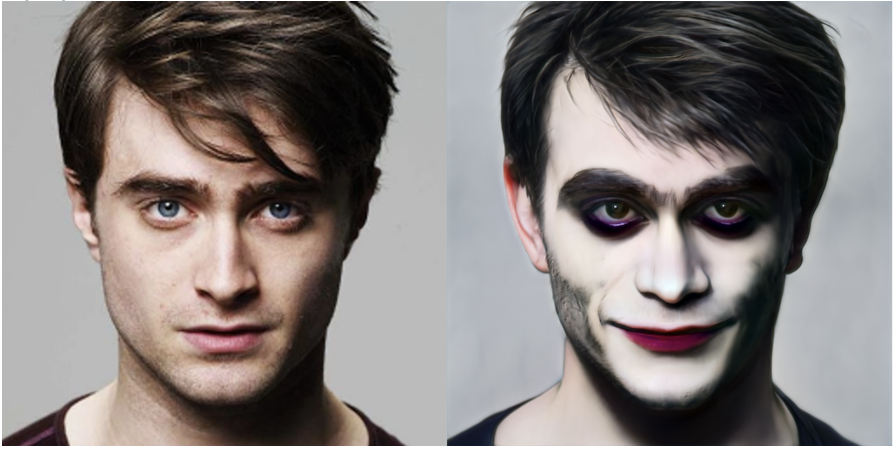

# Project for DLS: CLIP-Guided Domain Adaptation of Image Generators

## Описание задачи

В данном проекте мы воспроизводим результаты статьи “CLIP-Guided Domain Adaptation of Image Generators”, авторы которой предложили подход к редактированию изображений, основанный на дообучении самого генератора, используя только знания, заложенные в CLIP модели. В основе обучения лежит Directional CLIP loss – функция потерь, которая основана на CLIP loss. Суть этого метода в том, чтобы определить некоторое направление в CLIP пространстве между исходным изображением и редактированным и двигаться только в этом направлении. Таким образом, исходное изображение приближается к целевому и при этом не смещается сильно от первоисточника. Для этого рассчитываются расстояния между CLIP эмбеддингами исходного и целевого описания, а также CLIP эмбеддингами исходного и целевого изображения. Direction loss задается как CLIP loss между двумя этими расстояниями. Для генерации изображений используется StyleGan. Модель учитель генерирует исходное изображение, модель-ученик – измененное, веса этой модели оптимизируются с помощью Direction loss, позволяя генерировать на основе исходного изображения его вариант с нужными модификациями (стиль, макияж и тд.). В этой работе мы попробуем использовать такой подход, чтобы превращать человека в Джокера.

## Структура репозитория
* `src` - кастомная имплементация StyleGAN-NADA
* `stylegan2` - реализация StyleGAN2 из из https://github.com/rosinality/stylegan2-pytorch), 
* `nada_train.ipynb` - ноутбук с обучением 
* `nada_inference.ipynb` - ноутбук с инференсом 
* `project_report.pdf` - отчет о работе
* `README.md`

Ноутбук с обучением тяжелый и не открывается в github, для просмотра нужно скачать или открыть в github.dev

## Инструкция к запуску

Все обучение происходило в Colab. для запуска нужно скачать соответствующий блокнот
(`nada_inference.ipynb` / `nada_inference.ipynb`) и запустить его, в секции с установкой библиотек и загрузкой компонент есть все нужное

Ссылка на веса модели (они также подгружаются в ноутбуке с инференсом): https://drive.google.com/file/d/15zkZqUlfYQ4-Yy2C35b4Cw7SfxCNiHYU/view?usp=sharing

## Примеры работы 

Редактирование реальных фото с помощью модели 

